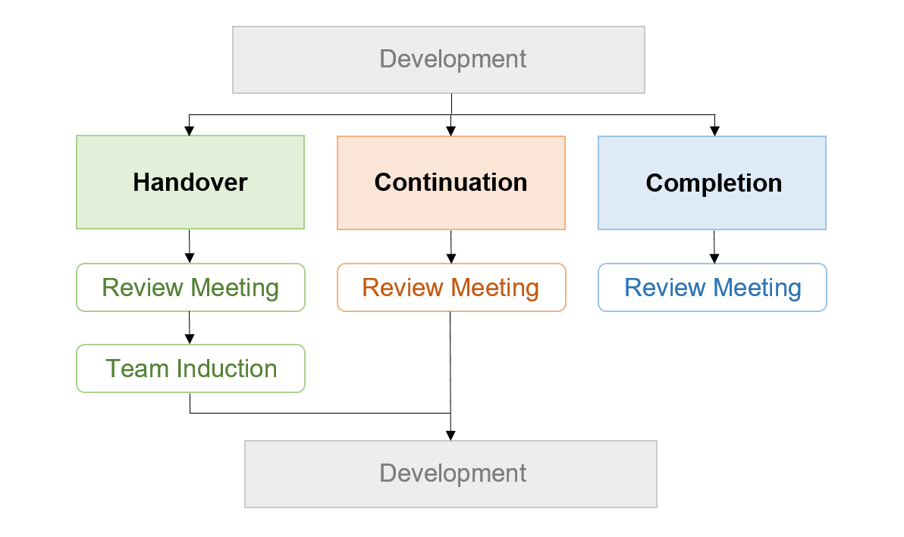

# Project Handover, Continuation & Completion

>_This section sets out a process for handing over or closing out projects that ensures any incoming Branch Leads or Project Managers are equipped to engage with the L&E Framework, and ethical learnings are being built into the design process for subsequent development phases or for other future projects._

When a project season comes to an end, one of three things will happen: a project will be handed over to another MDN team to continue, it continues development, or it will close for the immediate future. Either way, this is an important juncture in which to return to the goals, methods, and values established at its outset. Each Branch will have its own practices for what this looks like in terms of a given project. Here, the focus will be on continuity of ethical considerations and responsibilities.

