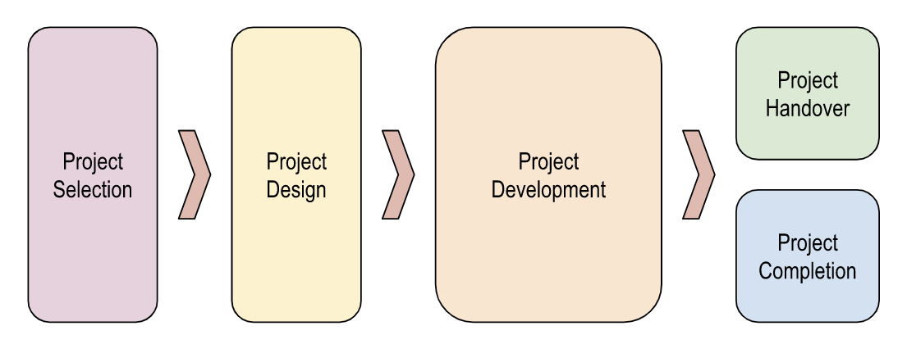

# Scope and Application

Undergraduate research projects are the cornerstone of Monash DeepNeuron (MDN). They offer the opportunity for student members to develop both their technical skills, in contribution to an existing body of Artificial Intelligence (AI) research, and other relevant competencies which they will take with them into their future workplaces.

One of these ‘soft’ skillsets is the ability to consider the ethical implications of their work and take steps to ensure any risk of harm is minimised. The *Ethical Framework for DeepNeuron Research Projects* has been designed by the Law & Ethics Committee to provide guidance for technical teams on how to safeguard against ethical risks during the different stages of a project’s development.

In doing so, the Committee has used the [Australian Government’s Artificial Intelligence Ethics Framework](https://www.industry.gov.au/publications/australias-artificial-intelligence-ethics-framework) to shape an approach to responsible AI development that is tailored to MDN’s specific needs and context. MDN’s Framework integrates these ethical principles into each stage of the project life cycle.

This framework creates responsibilities for Branch Leads and Project Managers in relation to risk management procedures. However, it is not solely for students in these roles. All team members benefit from, and are therefore expected to, understand the ethical approach MDN takes to its research.