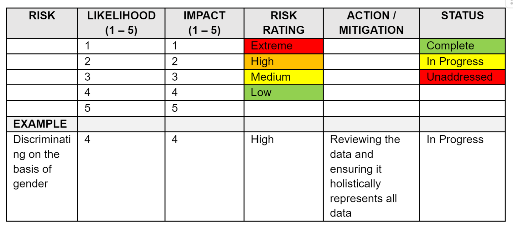

# Project Design
> _This section sets out an approach to ethical risk management which involves an initial assessment when a project is being designed and produces a tool that can be used throughout the remainder of the project._

When designing a project, the Branch Lead completes a risk assessment tool in relation to ethical challenges that may be presented by the project at its outset or as its development progresses. This is completed and/or reviewed in consultation with the Law & Ethics Committee.

