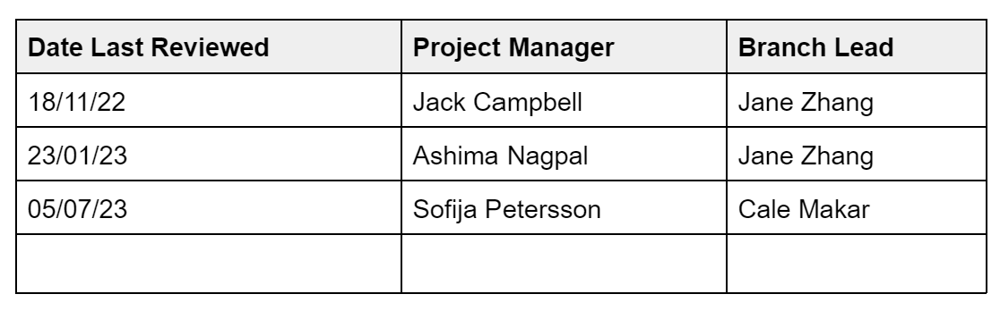

# Handover
## Review Meeting
In the lead up to a new project season, the Branch Lead will organise a meeting with a project’s outgoing and incoming Managers (where applicable) and a member of the Law & Ethics Committee.

The purpose of this meeting is to:
- Review and sign off on the project’s <u>Statement of Compatibility</u>
- Discuss how best to address key ethical considerations in pursuit of any new project targets
- Ensure the incoming Project Managers are aware of their responsibilities during the next <u>Development Phase</u> of the project.

### _Statment Of Compatibility_
When a project is initially selected for pursuit by MDN, the Branch Lead will complete a ‘Statement of Compatibility’, explaining how the project’s aims will further the <u>Ethical Values</u> of the organisation. This is kept on file and is introduced to each new Manager as the project progresses.

The Statement must be reviewed together during the meeting and signed off on by both the Branch Lead and the incoming or continuing Manager. A Statement of Compatibility for a project that has been running for three seasons will look like this:

## Team Induction
When new project team members are being introduced to an ongoing project, it is important that they are included in the discussion around ethical considerations. For new recruits joining their first full project, some grounding in this will be provided during induction and training.

Following the Review Meeting, the new or continuing Project Manager is responsible for leading a discussion with their team about the ethical implications of their work before any development work takes place. The presence of a Law & Ethics Committee member can be requested for this but is not mandatory. The Branch Lead is responsible for ensuring that all technical teams have made time to do this, and this will be the basis of a discussion with the Law & Ethics Committee at the conclusion of the first week of the project season Development Phase.

